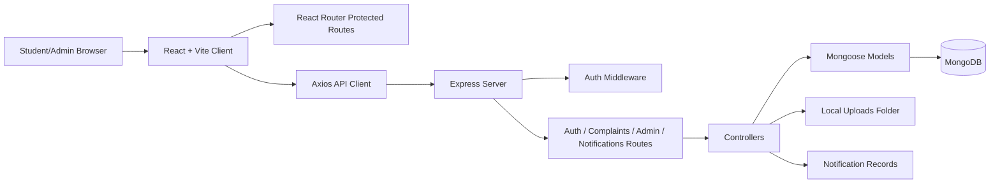

# Architecture

## Overview
The project is a two-tier MERN-style application with a Vite React client and an Express API backed by MongoDB. The client communicates with the API through `/api` routes and serves uploaded image references from `/uploads`.

## Client Structure
- `client/src/routes/AppRoutes.jsx`: route map and protected sections.
- `client/src/context/AuthContext.jsx`: auth state and token handling.
- `client/src/services/api.js`: Axios instance and local mock fallback.
- `client/src/pages`: landing, auth, dashboard, complaint, profile, notification pages.
- `client/src/components/common`: shared UI components.

## Server Structure
- `server/server.js`: Express app setup, middleware, route mounting, error handling.
- `server/routes`: API route definitions.
- `server/controllers`: business logic.
- `server/models`: Mongoose schemas.
- `server/middleware`: auth, validation, and upload handling.
- `server/utils`: seeding and heuristic complaint summarizer.

## Data Flow
1. User authenticates and receives JWT.
2. Client stores token and sends `Authorization: Bearer <token>`.
3. Server validates token and attaches `req.user`.
4. Controller performs database operation through Mongoose.
5. API returns JSON response to the client.
