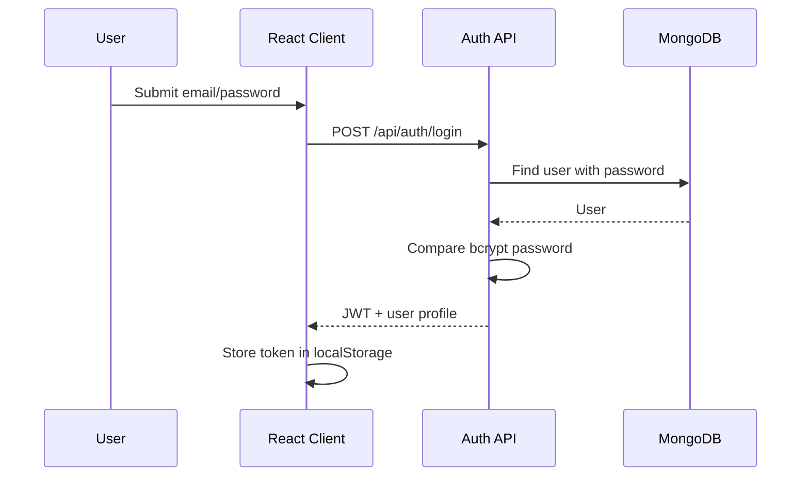

# Authentication

## Method
Authentication uses JSON Web Tokens signed with `JWT_SECRET`. Tokens expire after 30 days.

## Login Flow


## Authorization
| Layer | Implementation |
| --- | --- |
| Client | `ProtectedRoute` checks authenticated user and allowed roles |
| API | `protect` middleware verifies JWT |
| Admin API | `admin` middleware checks `req.user.role === 'admin'` |

## Password Handling
- Passwords are hashed with bcrypt before saving.
- Security answers are also hashed with bcrypt.
- Password and security answer fields use `select: false` in the User model.

## Token Usage
The client attaches:

```http
Authorization: Bearer <token>
```

## Password Recovery
Forgot-password flow asks for email, retrieves the stored security question, verifies the security answer, and writes a new hashed password.

## Current Security Notes
- Code includes development fallbacks for `JWT_SECRET`.
- Production deployments should always provide a strong `JWT_SECRET`.
- CORS is currently configured with `origin: '*'`.
