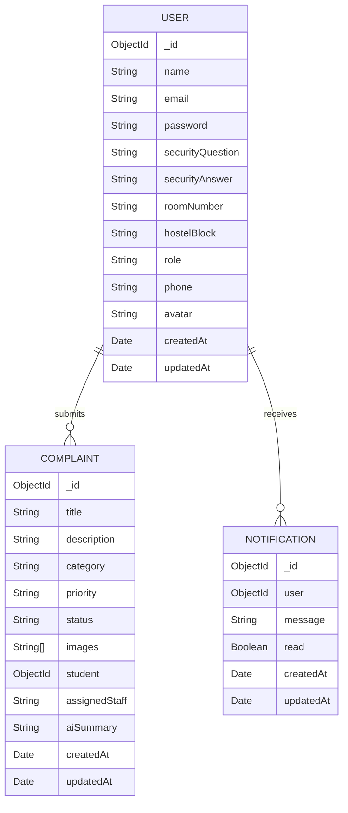

# Database Schema

Database: MongoDB
ODM: Mongoose

## User
| Field | Type | Notes |
| --- | --- | --- |
| `name` | String | Required |
| `email` | String | Required, unique, lowercase, email format |
| `password` | String | Required, hashed, min 6, excluded by default |
| `securityQuestion` | String | Required |
| `securityAnswer` | String | Required, hashed, excluded by default |
| `roomNumber` | String | Required for students |
| `hostelBlock` | String | Required for students |
| `role` | String | `student` or `admin`, default `student` |
| `phone` | String | Required |
| `avatar` | String | Optional |

## Complaint
| Field | Type | Notes |
| --- | --- | --- |
| `title` | String | Required |
| `description` | String | Required |
| `category` | String | Electrical, Water, Internet, Cleaning, Furniture, Mess, Room, Security, Others |
| `priority` | String | Low, Medium, High |
| `status` | String | Pending, Accepted, In Progress, Resolved, Rejected |
| `images` | String[] | Uploaded file URLs |
| `student` | ObjectId | References User |
| `assignedStaff` | String | Optional |
| `aiSummary` | String | Generated heuristic summary |

## Notification
| Field | Type | Notes |
| --- | --- | --- |
| `user` | ObjectId | References User |
| `message` | String | Required |
| `read` | Boolean | Default `false` |
