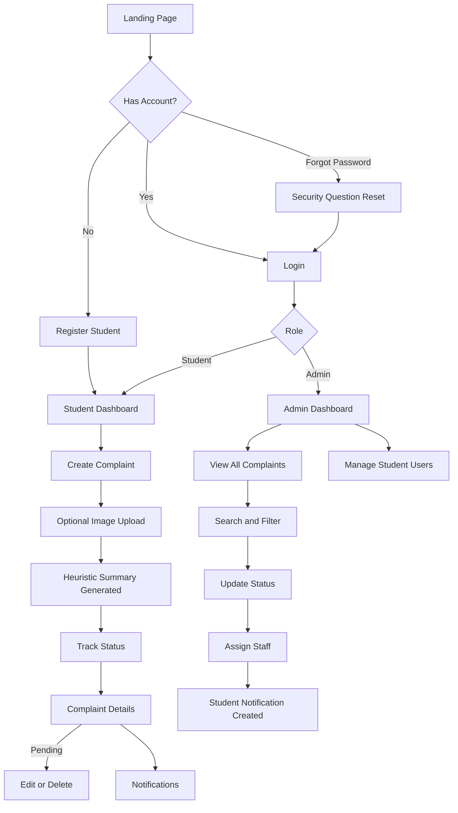

# User Flow

## Student Journey
1. Register or login.
2. Submit a complaint with required details.
3. Optionally upload images.
4. Track status from dashboard/details page.
5. Receive notification when status changes.

## Admin Journey
1. Login as admin.
2. Review dashboard metrics and recent complaints.
3. Filter complaint list.
4. Update complaint status and assigned staff.
5. Manage student accounts when required.
